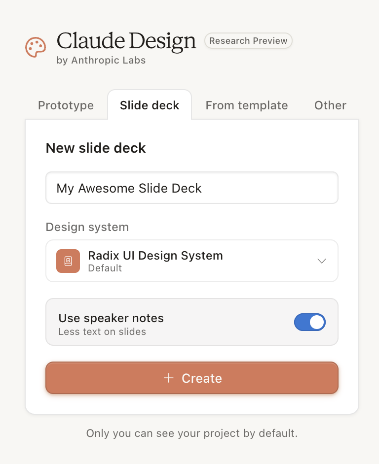
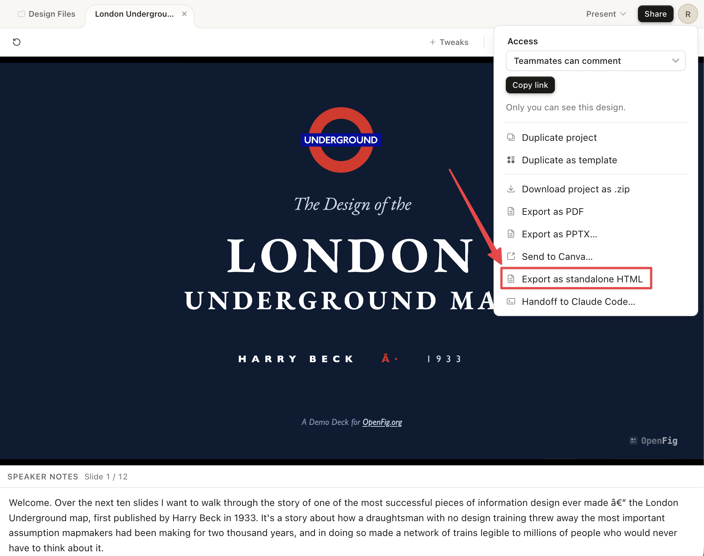
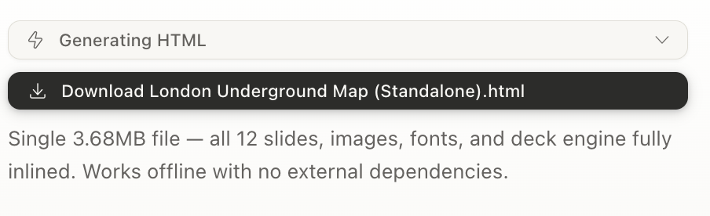

<a href="https://www.buymeacoffee.com/coenenrob9"></a>

Open tools for Figma files.

Parse, inspect, render, and modify `.deck` and `.fig` files without the Figma application.

## Install

```bash
npm install -g openfig-cli
```

Node 18+. No build step. Pure ESM.

## Convert from Claude Design

OpenFig converts standalone HTML exports from
[claude.ai/design](https://claude.ai/design) into editable Figma Slides
decks — text, images, vectors, layouts, and speaker notes carry through
as native nodes. Not a flat raster.

### 1. Create a Slide Deck project

In Claude Design, choose the **Slide deck** tab and create your project.
The **Use speaker notes** toggle is optional; if on, OpenFig maps notes
to each slide.



### 2. Build your deck, then export

When you're done designing, click **Share → Export as standalone HTML**.



Claude Design generates a single self-contained file named
`{Project Name} (Standalone).html` — all slides, images, fonts, and the
rendering engine inlined. Works offline.



### 3. Convert to .deck

```bash
openfig convert-html "London Underground Map (Standalone).html" -o lu.deck
open lu.deck   # opens directly in Figma Slides
```

## File Format Support

| Product | Extension | Read | Render | Modify |
|---------|-----------|------|--------|--------|
| Figma Slides | `.deck` | ✅ | ✅ PNG / PDF | ✅ |
| Figma Design | `.fig` | ✅ | ✅ PNG / PDF | ✅ |

## CLI

```bash
# Read & inspect (works on .deck and .fig)
openfig inspect deck.deck              # node hierarchy tree
openfig list-text deck.deck            # all text and image content per slide
openfig list-overrides deck.deck       # editable override keys per symbol

# Render (works on .deck and .fig)
openfig export deck.deck               # export slides/frames as PNG
openfig pdf deck.deck                  # export as multi-page PDF

# Create (.deck only)
openfig create-deck -o new.deck [--title "Name"] [--layout cover --layout content ...]

# Modify (.deck only)
openfig update-text deck.deck -o out.deck --slide <id> --set "key=value"
openfig insert-image deck.deck -o out.deck --slide <id> --key <nodeId> --image <path>
openfig clone-slide deck.deck -o out.deck --template <id|name> --name <name> [--set key=value ...]
openfig remove-slide deck.deck -o out.deck --slide <id>
openfig roundtrip in.deck out.deck     # decode + re-encode validation
```

> Full CLI reference: [docs/cli.md](docs/cli.md)

## Why native `.deck`?

Figma Slides lets you download and re-upload `.deck` files losslessly. Exporting to `.pptx` is lossy — vectors rasterize, fonts fall back, layout breaks. OpenFig makes this native round-trip programmable: download, modify, re-upload.

Plug in Claude Cowork or any coding agent and you have an AI that can read and edit Figma presentations end-to-end — without opening the Figma UI.

## Agentic / MCP Integration

> Install guide, MCP workflows, and template states: [docs/agentic/claude-cowork.md](docs/agentic/claude-cowork.md)

## Docs

| | |
|---|---|
| MCP / Claude workflows | [docs/mcp.md](docs/mcp.md) |
| High-level API | [docs/api-spec.md](docs/api-spec.md) |
| Low-level FigDeck API | [docs/library.md](docs/library.md) |
| Template workflows | [docs/template-workflows.md](docs/template-workflows.md) |
| File format internals | [openfig-core/docs](https://github.com/OpenFig-org/openfig-core/tree/main/docs) |

## License

MIT

## Disclaimer

Figma is a trademark of Figma, Inc.

OpenFig is an independent open-source project and is not affiliated with, endorsed by, or sponsored by Figma, Inc.
